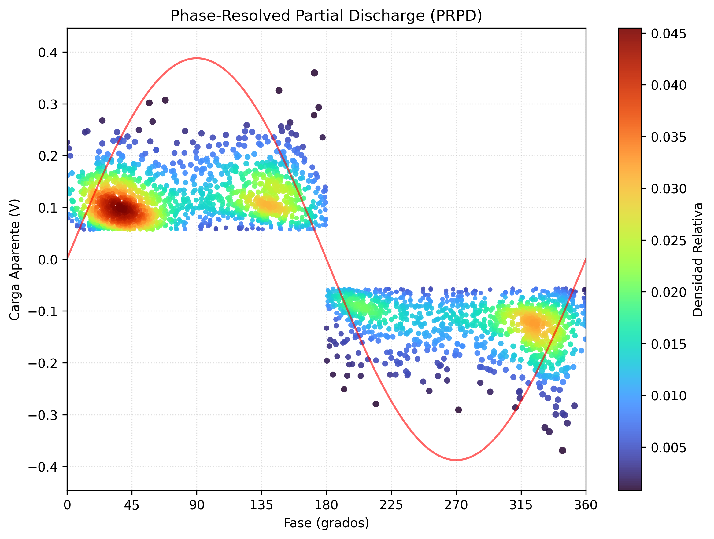
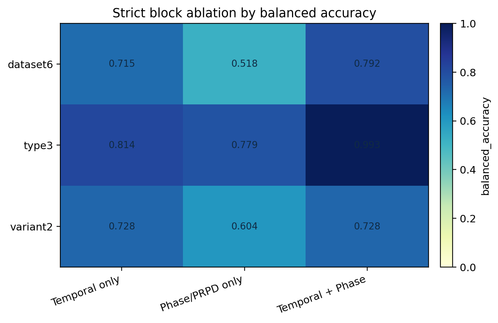
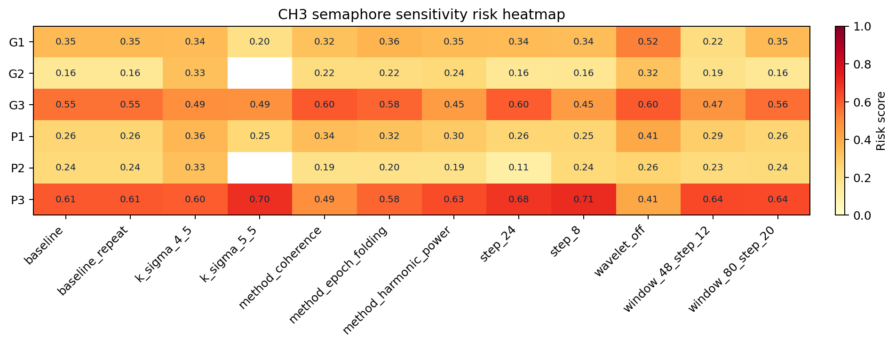

# DeltaPD

DeltaPD es un framework de analisis de descargas parciales UHF orientado a tesis e investigacion aplicada. Su nucleo combina:

- dinamica temporal entre pulsos (`delta t`),
- reconstruccion ciega de fase y PRPD sin referencia externa,
- estudios por adquisicion (`state` / `alarm`),
- y comparativos entre tipos de descarga en `CH3`.

El canal canonico de tesis es `CH3`. `CH2` se usa como apoyo en carpetas gemelas y `CH4` queda fuera del eje principal.



## Que hace el repositorio

- Carga trazas UHF desde `CSV`, `MAT` y `HDF5` con auditoria de ingesta.
- Detecta pulsos y construye la serie `delta t`.
- Reconstruye fase de red de forma ciega con `coherence`, `harmonic_power`, `epoch_folding`, y baselines como `H-test` y `PDM`.
- Extrae descriptores temporales, de fase, de amplitud y por semiperiodo.
- Estudia transiciones locales, mezcla de metodos y offsets locales de frecuencia.
- Ejecuta estudios `state` / `alarm` por adquisicion y comparativos de `internal`, `superficial` y `multiple`.
- Genera reportes, PDFs y un workbench en Dash para revisar resultados.

## Estado actual del proyecto

La lectura cientifica fuerte del repositorio hoy es esta:

- La mejor separacion de tipo de descarga en `CH3` sale de combinar `delta t + fase/PRPD`, no de una imagen PRPD aislada.
- En el comparativo `CH3`, el bloque `Temporal + Phase` alcanza:
  - `type3`: `macro_f1 = 0.9858`, `balanced_accuracy = 0.9929`
  - `dataset6`: `macro_f1 = 0.7888`, `balanced_accuracy = 0.7924`
- `P3` y `G3` muestran la evidencia mas fuerte de mezcla local y no estacionariedad.
- El semaforo exploratorio de `CH3` ya es repetible y usa compuerta `gray` por ingesta dudosa.

Lo que no conviene afirmar todavia:

- que `PRPD-only` clasifique bien por si solo;
- que la capa secuencial local sea ya un clasificador fuerte de caso;
- que el semaforo sea un diagnostico absoluto. Hoy es una capa relativa y exploratoria de riesgo local.

## Hallazgos recientes

### 1. Ablacion estricta en CH3

La fusion temporal + fase domina claramente a los bloques aislados.



### 2. PRPD local y transiciones

El mapa de transiciones alinea en un mismo eje temporal:

- ventanas de transicion del estudio,
- metodo local ganador del blind PRPD,
- offset local de frecuencia respecto al global,
- confianza axial local.


### 3. Sensibilidad del semaforo en CH3

El sweep de sensibilidad ya corre en background y confirma que:

- `k_sigma = 5.5` es demasiado agresivo,
- `wavelet off` mueve el riesgo mas de lo deseable,
- `window 80/20` se mantiene cerca del baseline.



## Capas principales del pipeline

### 1. Ingesta y preproceso

- Carga robusta de archivos heterogeneos.
- `ingestion_audit` con trazabilidad de columnas, delimitador y fuente de `fs`.
- Denoise wavelet opcional.

### 2. Deteccion de pulsos

- Threshold y `CA-CFAR`.
- `CA-CFAR` ya esta vectorizado.
- La separacion minima fisica ya no cae en `0.0` por defecto: si no se especifica, se usa `5 / fs`.

### 3. Blind PRPD

Metodos disponibles:

- `coherence`
- `harmonic_power`
- `epoch_folding`
- `h_test`
- `pdm`
- `phase_distance_correlation` como benchmark lento/opt-in

La calibracion local exporta offsets y confianza por ventanas, lo que permite estudiar mezcla local en vez de depender solo de un PRPD global agregado.

### 4. Capa secuencial local

Sobre la traza local deduplicada se agregaron:

- `BOCPD`
- `HMM` gaussiano ligero de 2 estados
- `semi-Markov` ligero

Estas capas hoy sirven para endurecer la semantica del semaforo y la lectura de persistencia local. No son el resultado principal del paper.

### 5. Workbench

El workbench Dash ahora:

- prioriza `CH3` como modo tesis,
- acepta jobs locales en background para corridas costosas,
- muestra sensibilidad del semaforo, comparativos e imagenes prioritarias del estudio,
- y conserva trazabilidad de ingesta y de resultados.

## Flujos principales

```bash
pip install -e .

# Demo legado de delta t
python -m deltapd run-legacy --seed 42 -n 4096

# Workflow general de tesis
python -m deltapd run-thesis --config campaign/config_thesis.yaml

# Analisis por adquisicion
python -m deltapd run-material --config campaign/config_material.yaml

# Estudio de descriptores por ventana
python -m deltapd run-study --config campaign/config_descriptor_study.yaml

# Batch state/alarm canonico de CH3
python -m deltapd run-state-alarm-batch --config campaign/config_state_alarm_ch3.yaml

# Comparativo canonico de CH3
python -m deltapd run-comparative-study --config campaign/config_comparative_ch3.yaml

# Pruebas
pytest -q
```

## Configuracion canonica actual

En `CH3`, el baseline operativo actual se apoya en:

- `k_sigma = 5.0`
- `wavelet_denoise = true`
- `blind_prpd.calibration_method = auto`
- ventanas locales de estudio `64 / 16`
- ventanas locales de blind PRPD `256 / 128`

Archivos relevantes:

- `campaign/config_state_alarm_ch3.yaml`
- `campaign/config_comparative_ch3.yaml`

## Estructura del repositorio

```text
src/deltapd/
  blind_prpd.py
  descriptors.py
  loader.py
  semaphore.py
  workbench.py
  workbench_jobs.py
  workbench_worker.py
  campaign/
    material_state.py
    descriptor_study.py
    state_alarm_batch.py
    comparative_thesis_study.py

campaign/
  config_thesis.yaml
  config_state_alarm_ch3.yaml
  config_comparative_ch3.yaml

tests/
  test_blind_prpd.py
  test_descriptors.py
  test_state_alarm_batch.py
  test_comparative_thesis_study.py
  test_semaphore.py
  test_workbench.py
  test_workbench_jobs.py
```

## Regla de interpretacion

El repositorio separa a proposito dos preguntas distintas:

- `type`: diferencias entre `internal`, `superficial` y `multiple` entre adquisiciones;
- `state/alarm`: cambios de regimen dentro de una misma adquisicion larga.

No mezcla todas las ventanas en una sola linea de tiempo global porque eso seria cientificamente incorrecto.

## Validacion

Estado local mas reciente de esta rama:

- `103 passed`

## Licencia

Ver [license.md](license.md).
