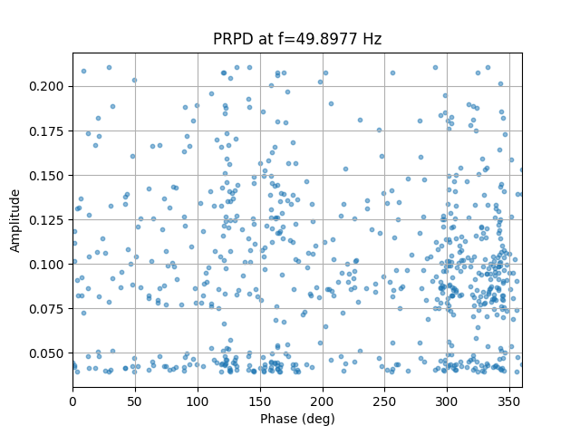
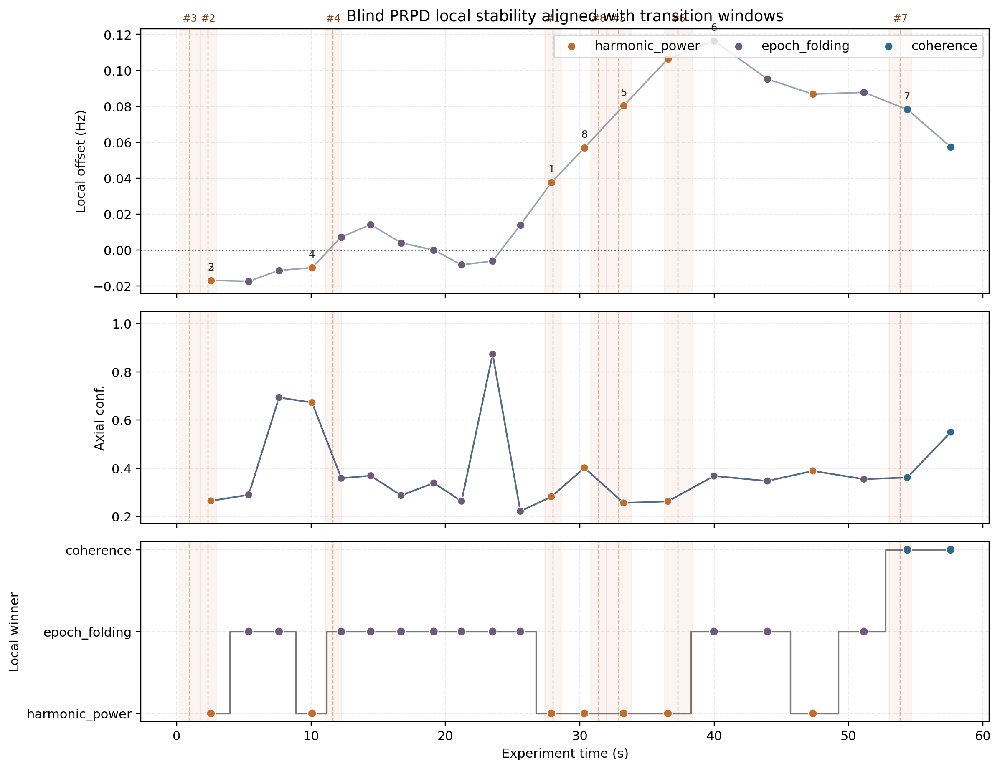

# DeltaPD

DeltaPD is a UHF partial-discharge analysis framework centered on inter-pulse interval (`delta t`) dynamics, blind PRPD reconstruction, and thesis-scale comparative/state studies.



## What the repository covers

- Pulse detection and `delta t` extraction from UHF traces.
- Legacy tracking workflow with Kalman, EWMA, and CUSUM diagnostics.
- Blind PRPD frequency/phase reconstruction without external voltage reference.
- Within-test `state` / `alarm` studies for long acquisitions.
- Cross-dataset comparative studies for `internal`, `superficial`, and `multiple` regimes.
- Batch reporting, PDFs, and a Dash workbench for campaign review.

## Current blind-PRPD layer

- `coherence`, `harmonic_power`, and `epoch_folding` are available as serious blind calibration families.
- Local blind-PRPD traces can be aligned against transition windows found by the descriptor study.
- Batch summaries aggregate method mix, local frequency offsets, and axial confidence across `P1/P2/P3/G1/G2/G3`.



## Main workflows

### 1. Legacy pipeline

Preserves the original four-phase `delta t` workflow:

- stochastic wavelet optimisation
- pulse detection and `delta t` extraction
- Kalman / adaptive EWMA / CUSUM tracking
- empirical diagnostics and validation

### 2. Thesis campaign workflow

Runs acquisition-level studies and exports stable artifacts for benchmark and gemela datasets:

- time-domain metrics
- spectral metrics
- event and window summaries
- descriptor selection studies
- state/alarm batch summaries
- comparative type studies

## Quickstart

```bash
pip install -e .

# Legacy four-phase demo
python -m deltapd run-legacy --seed 42 -n 4096

# Thesis campaign mode
python -m deltapd run-thesis --config campaign/config_thesis.yaml

# Material-state mode
python -m deltapd run-material --config campaign/config_material.yaml

# Descriptor study mode
python -m deltapd run-study --config campaign/config_descriptor_study.yaml

# State/alarm batch mode
python -m deltapd run-state-alarm-batch --config campaign/config_state_alarm_ch3.yaml

# Comparative type study
python -m deltapd run-comparative-study --config campaign/config_comparative_ch3.yaml

# Tests
pytest
```

## Repository structure

```text
src/deltapd/
  __main__.py
  blind_prpd.py
  blind_prpd_stress.py
  pipeline.py
  descriptors.py
  statistics.py
  workbench.py
  campaign/
    thesis_campaign.py
    material_state.py
    descriptor_study.py
    state_alarm_batch.py
    comparative_thesis_study.py
    pdf_reports.py

campaign/
  config_thesis.yaml
  config_descriptor_study.yaml
  config_state_alarm_ch3.yaml
  config_comparative_ch3.yaml

tests/
  test_blind_prpd.py
  test_descriptor_study.py
  test_state_alarm_batch.py
  test_comparative_thesis_study.py
  test_workbench.py
```

## Design rule

The comparative `type` study and the within-test `state/alarm` study are kept separate on purpose. The repository treats them as different scientific questions instead of mixing all windows into one global timeline.

## Validation status

Latest local verification on this workspace:

- `74 passed`
- `2 warnings` from pytest config compatibility (`collect_ignore*`)

## License

See [license.md](license.md).
